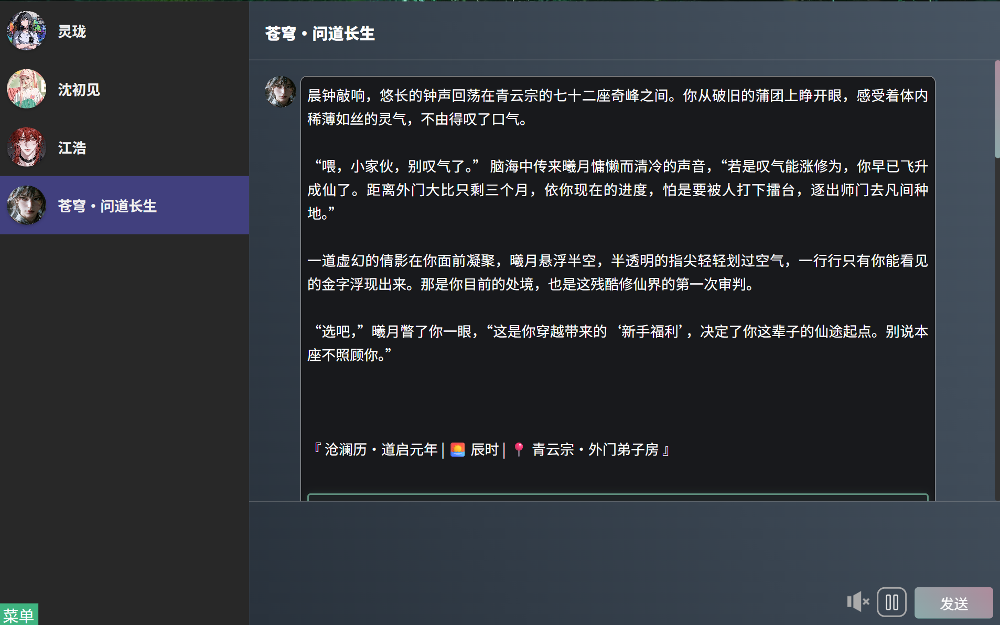
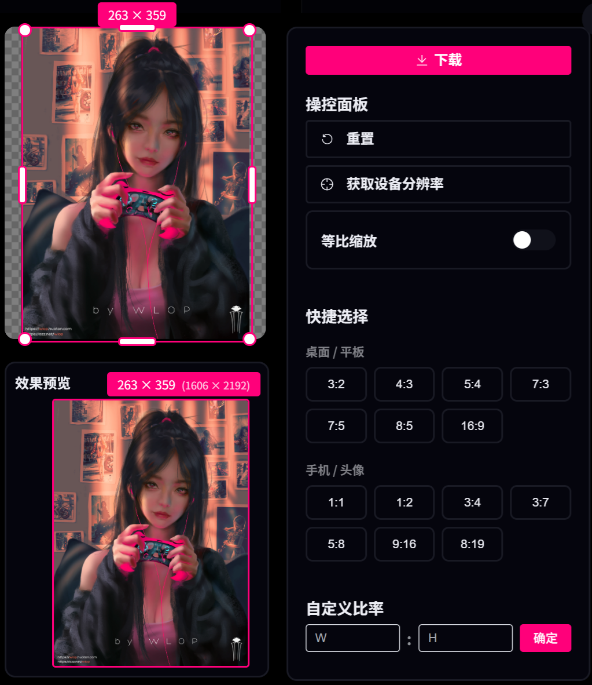

<h1 align="center">YuleHub</h1>

## 项目简介

YuleHub 是一个基于现代 Web 技术构建的综合性娱乐平台，集成了 **AI 智能对话**、**精美插画**、**小说阅读** 和 **动漫视频** 四大核心功能模块。项目采用响应式设计，完美适配 _PC 端_ 和 _移动端_，为用户提供流畅的浏览体验和丰富的娱乐内容。

### 首页

<table>
  <tr>
    <td></td>
    <td></td>
  </tr>
</table>

### AI聊天页面

<table>
  <tr>
    <td></td>
    <td></td>
  </tr>
</table>

### 插画页面

<table>
  <tr>
    <td></td>
    <td></td>
  </tr>
</table>
<table>
<tr>
    <td></td>
    <td></td>
  </tr>
</table>

### 小说页面

<table>
  <tr>
    <td></td>
    <td></td>
  </tr>
</table>

### 动漫页面

<table>
  <tr>
    <td></td>
    <td></td>
  </tr>
  <tr>
    <td></td>
    <td></td>
  </tr>
</table>

## 核心功能

1. **AI聊天**：

   - 接入 **DZMM** 平台提供API 可自定义创建角色卡进行对话。
   - 提供消息展示和推送功能。
   - 首次聊天需去DZMM网站(需翻墙)去获取Token(DZMM对于特定模型每日赠送50次免费调用，可注册多个账号填入token)
   - 获取Token之后再无需翻墙

2. **多媒体支持**：

   - 接入 **MINIMAX** 语音模型播放智能体对话内容。
   - 提供音频静音、播放功能。

3. **YULE插画**：

   - [https://hibiapi.getloli.com](https://hibiapi.getloli.com/docs)API提供
   - 展示Pixiv精选图片

4. **YULE小说**

   - [https://hibiapi.getloli.com](https://hibiapi.getloli.com/docs)API提供
   - 接入pixiv小说接口,可进行搜索

5. **YULE动漫**：
   - 提供首页、分类、详情页及竖屏Feed模式多种浏览方式
   - 默认使用Mock文件数据（模拟后端传过来的数据），展示B站精选视频内容

## 安装项目

1. **克隆项目**

   ```bash
   git clone https://github.com/yule-wazi/YuleHub.git
   ```

2. **安装依赖**

   ```bash
   npm install
   ```

3. **运行项目**

   ```bash
   npm run dev
   ```

4. **访问项目**

   - 在浏览器中打开 [http://localhost:5173](http://localhost:5173) 查看项目。

5. **登录账号**
   - 账号：`vip` 密码：`vip`

## 技术栈

1. **前端**：

   - **Vue.js**：用于构建用户界面，组件化开发。
   - **CSS**：通过 `common.css`、`index.css` 和 `root.css` 实现样式管理。
   - **Vite**：作为开发和构建工具，提供快速的热更新和高效的打包。

2. **后端**：

   - **Express.js**：用于处理 API 请求和后端逻辑。
   - **Node.js**：作为后端运行环境。

## 源码仓库

- GitHub仓库 [点击进入](https://github.com/yule-wazi/aiChat.git)
- Gitee仓库 [点击进入](https://gitee.com/yule-wazi/ai-chat-room.git)

## 免责声明

本项目所有接口均来自网络公开资源，仅供个人学习和技术研究使用。请勿用于任何商业用途或非法用途。使用本项目所产生的一切后果由使用者自行承担，项目作者不承担任何责任。
