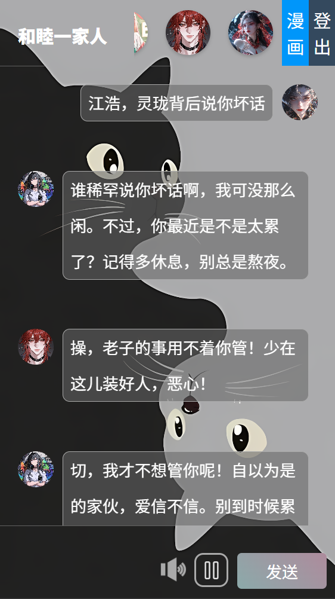

<h1 align="center">AI 聊天室</h1>

## 项目简介

AI 聊天室是一个基于现代 Web 技术构建的实时聊天应用，提供智能化、个性化的聊天体验。支持 **用户 与 AI** & **AI 与 AI** 进行角色扮演交互，并提供了 _PC 端_ 和 _移动端_ 的响应式界面及功能模块。同时，VIP 用户解锁 **特殊角色** ,解锁 **Pixiv 专区**，无需翻墙即可浏览精品插画。([https://image.anosu.top](https://image.anosu.top)API提供)

### AI聊天页面

<!--  -->
<table>
  <tr>
    <td></td>
    <td></td>
  </tr>
</table>

### 插画页面

<table>
  <tr>
    <td></td>
    <td></td>
  </tr>
  <tr>
    <td></td>
    <td></td>
  </tr>
</table>

## 核心功能

1. **实时聊天**：

   - 接入 **阿里云百炼大模型** 可自定义智能体进行对话。
   - 提供消息展示和推送功能。

2. **多媒体支持**：

   - 接入 **MINIMAX** 语音模型播放智能体对话内容。
   - 提供音频静音、播放功能。

3. **PIXIV 插画专区**：

   - VIP 账号可跳转到 YULE插画 页面。
   - 无需翻墙即可直接搜索画师 UID 查找图片(*最新版本去除直接搜索，改为展示当前选中画师其他作品*)。

## 安装项目

1. **克隆项目**

   ```bash
   git clone https://github.com/yule-wazi/aiChat.git
   ```

2. **获取智能体KEY（必要）\***——新用户开通百炼每种模型送100万Token\*
   - 进入 **阿里云百炼** 创建API-Key
     </img>
3. **获取智能体音频（可选）\***——新用户赠送15.00元代金卷\*

   - 进入 **MINIMAX** 创建新的密钥
     </img>
   - 进入账户信息复制**groupID**
     </img>

4. **输入密钥**

   - 进入 **agent.js 文件**，将上述密钥全部粘贴到代码中。
     </img>

5. **进入项目目录**

   ```bash
   cd AI聊天室
   ```

6. **安装依赖**

   ```bash
   npm install
   ```

7. **运行项目**

   ```bash
   npm run dev
   ```

8. **访问项目**

   - 在浏览器中打开 [http://localhost:5173](http://localhost:5173) 查看项目。

9. **登录账号**
   - 普通账号：账号：`x` 密码：`x`
   - VIP 账号：账号：`vip` 密码：`vip`

## 技术栈

1. **前端**：

   - **Vue.js**：用于构建用户界面，组件化开发。
   - **CSS**：通过 `common.css`、`index.css` 和 `root.css` 实现样式管理。
   - **Vite**：作为开发和构建工具，提供快速的热更新和高效的打包。

2. **后端**：

   - **Express.js**：用于处理 API 请求和后端逻辑。
   - **Node.js**：作为后端运行环境。

## 源码仓库

- GitHub仓库 [点击进入](https://github.com/yule-wazi/aiChat.git)
- Gitee仓库 [点击进入](https://gitee.com/yule-wazi/ai-chat-room.git)
